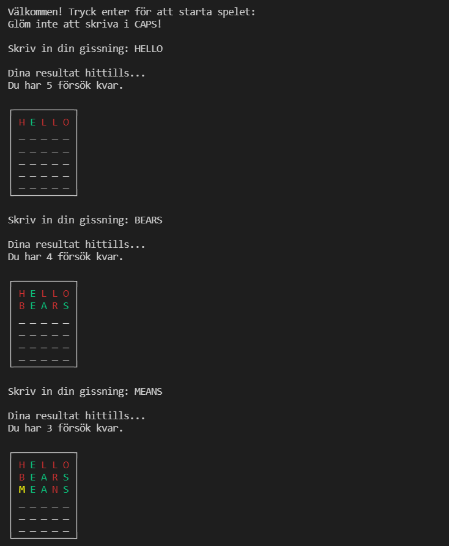
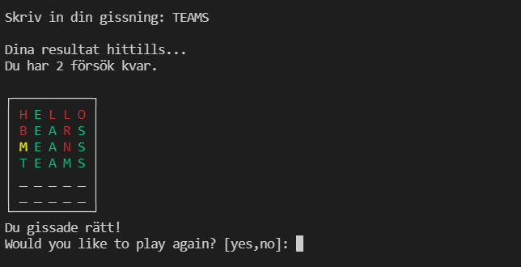

# Wordle_a_fun_game

## Beskrivning

***Här bör du kort förklara vilket eller vilka språk programmet är skrivet i samt vad syftet med projektet är.***

Denna README är skriven i markdown. Den är till för att ge ett exempel på vad en README kan innehålla och hur den kan se ut.

## Teknologier/Språk/Byggt med - välj en

***Här kan du beskriva vilka språk som driver vilka delar av projektet, exempelvis att du skrivit frontend med JavaScript och Python för backend. Det kan även vara nyttigt att berätta vilka ramverk eller bibliotek du använt här för de olika delarna. För exemplena givna är React (för JS) och Flask (Python) bra att nämna. Utelämna add-ons eller plugins, lämna dessa till Acknowledgements.***

- Python
- Markdown

## Krav

- Python 3.9.6+
- Colorama
- Random
- OS

## Installation

***För att köra programmet listar du här vad som behövs och hur det installeras. Exempel:***

1. Klona repot
```cmd
    git clone https://github.com/JesperLundbeerg/Wordle_a_fun_game
```
2. Installera colorama
```cmd
pip install colorama
```
3. Installera den senaste versionen av Python nedan:
>https://www.python.org/downloads/

## Example (exempelkörning)




## To do/Roadmap (Att göra/Plan)

***Det kan vara nyttigt att få andra som läser om projektet att få veta vad du saknar just nu i programmet. Gör detta gärna genom en lista där färdiga saker strukits över.***
Exempel:

- [x] Påbörja readme
- [x] Implementera färg i terminalen
- [x] Göra så att man kan skriva utan CAPS
- [ ] Instruktioner för spelet, när man börjar.
- [ ] Lägga till en färg för dupletter av bokstaven
- [ ] Ytterligare språk
    - [x] Svenska
    - [ ] Engelska
    - [ ] Spanska
- [ ] Språk på ordlista
    - [x] Engelska
    - [ ] Svenska
    - [ ] Spanska
- [ ] Utöka ordlistan

## Changelog

### Version 1.0.1

#### Tillagt eller ändrat

- Ordlista
- Struktur för spelet
- Wordle-class

#### Borttaget

Inget borttaget då det var första gången som jag arbetade med denna uppgift.

### Version 1.0.2

#### Tillagt eller ändrat

- Lade till Lettercondition-class
- Hur många försök du har kvar att gissa ord
- Tillagt lite mer i main()

#### Borttaget

- Bytt ut kod i main()

### Version 1.0.3

#### Tillagt eller ändrat

- Begränsad ordlängd (5 bokstäver)

#### Borttaget

- Ändrat en print-sats

### Version 1.0.4

#### Tillagt eller ändrat

- Lagt till färg på bokstäverna i terminalen
- Lagt till en ram för att Wordle, och även rader för orden som fylls på vartefter man gissar.

#### Borttaget

- Inte tagit bort något viktigt

### Version 1.0.5

#### Tillagt eller ändrat

- Lagt till filhantering för ordlista
- Lagt till ny ordlista med fler ord

#### Borttaget

- Gammal ordlista

## Att bidra

Bedömning på denna uppgift är ännu inte gjord än och därför kommer inga pull requests tillåtas. Däremot kommer detta ändras så fort bedömning är klar.

Vid större förändringar önskar jag att en issue öppnas för diskussion om vad som ska förändras.

## Licens

[MIT](https://choosealicense.com/licenses/mit/)

## Kontakt

Jesper Lundberg - jesper.lundberg@elev.ga.ntig.se

Projektlänk: https://github.com/JesperLundbeerg/Wordle_a_fun_game

## Erkännanden

- https://www.studytonight.com/python-howtos/how-to-print-colored-text-in-python
- https://en.wikipedia.org/wiki/Box-drawing_character
- https://www.programiz.com/python-programming/property
- Elliot Eriksson
- Felix Larsson